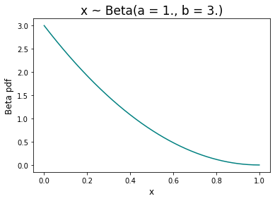

# CAMISIM (new) 'known distribution' modality

[](https://img.shields.io/badge/Python-v3.9-informational)

## Why this new modality
The modality called **known distribution** is built starting from the _de novo_ mode of [CAMISIM](https://github.com/CAMI-challenge/CAMISIM).
In the **known distribution** modality, as well as in all the other already available modalities in CAMISIM, new strains can be generated through sgEvolver.

What this new modality does differently is the community design step, which, in this case, is based on a distribution given, in input, by the user, and not randomly generated 
from a log-normal distribution (that is what happens in the four original modalities of CAMISIM).

Once the new strains are generated, this new modality will distribute the relative abundances of each "original" genome to all its simulated strains. An example of this process 
can be found [here](https://github.com/Ettore1024/MetaGeSim-AMR#redistribution-of-abundances).

In this repository you can find the new version of the CAMISIM tool, in which the above-described extra modality in the _de novo_ mode is implemented. A **Snakefile** is presented, too;
it allows to define a simple pipeline which was used for Antimicrobial Resistance (AMR) studies, for the synthetic data generation step.

The combination of these two pieces of scripts forms the **MetaGeSim-AMR** tool, a MetaGenomic Simulation tool suited for AMR studies.

# Installation
For the installation, you may simply launch the following command:

    git clone https://github.com/Ettore1024/MetaGeSim-AMR.git

In this way, both the new version of CAMISIM and the Snakemake pipeline, which compose the **MetaGeSim-AMR** tool, will be installed.

## Dependencies
In order to properly work, the **MetaGeSim-AMR** tool needs some dependencies to be installed. The list of dependencies for CAMISIM can be found [here](https://github.com/CAMI-challenge/CAMISIM/wiki/User-manual#dependencies).  
To be more precise, the conda-installable dependencies ([BIOM](https://pypi.org/project/biom-format/), [Biopython](https://biopython.org/), 
[Numpy](https://numpy.org/), [Matplotlib](https://matplotlib.org/)) are not required to be manually installed by the user when working with the Snakemake pipeline, since a
conda environment is internally set up when launching the pipeline; the characteristics of the environment can be found in [camisim_env.yaml](https://github.com/Ettore1024/MetaGeSim-AMR/blob/main/camisim_env.yaml).

All the other dependencies ([Perl 5](https://www.perl.org/), [wgsim](https://github.com/lh3/wgsim), [NanoSim](https://github.com/abremges/NanoSim), 
[PBsim](https://github.com/pfaucon/PBSIM-PacBio-Simulator), [SAMtools 1.0](http://www.htslib.org/)) may be installed following the instructions presented in each site. 

# Documentation
A complete documentation for the original CAMISIM tool can be found [here](https://github.com/CAMI-challenge/CAMISIM/wiki/User-manual).

The following sections will be about the new _known distribution_ modality, together with its features and options, and the Snakemake pipeline.

## How to use the tool
The **MetaGeSim-AMR** tool allows to generate metagenomic synthetic data only starting from two input files (`input.tsv` and `input.json`).
In order to this, the Snakemake pipeline must be used (see [here](https://github.com/Ettore1024/MetaGeSim-AMR#snakemake-pipeline) for further details).

On the other hand, the new modality of CAMISIM (_known distribution_) may be used also outside the Snakemake pipeline, but in that case an extra input file
(described [here](https://github.com/Ettore1024/MetaGeSim-AMR#the-new-file-of-abundances)) and three new parameters in the configuration file 
(described [here](https://github.com/Ettore1024/MetaGeSim-AMR#the-new-configuration-file-parameters)) are required. 

An in-depth description is proposed in the following sections.

### The aim of the known distribution modality:
The _known distribution_ modality is a solution to the lack of a metagenomic simulation framework when having both the _a priori_ known distribution of the microbial population, and the need of 
simulating (synthetic) strains.

It is worth pointing out that the original version of CAMISIM may work in two different modes, the so-called _from profile_ and _de novo_. In the _from profile_ mode, the user gives in input a file 
with the population distribution, but no strain is generated during the simulation; on the other hand, the _de novo_ mode is based on the creation of new strains (through a
tool called [sgEvolver](https://darlinglab.org/mauve/developer-guide/benchmarking.html)), but the population distribution is randomly generated starting from a log-normal distribution 
(further details may be found [here](https://github.com/CAMI-challenge/CAMISIM/wiki/Distribution-of-genomes)).

Thus, the _known distribution_ modality proposes a way to combine these two different approaches.

The known distribution_ modality is a (sub-)mode of the _de novo_ one. The idea behind it is just to change the way in which the population distribution is generated. 
The four original modality of CAMISIM in the _de novo_ mode are _differential_, _replicates_, _timeseries normal_, and _timeseries lognormal_. 
It is worth mentioning that they are all based on the log-normal distribution and they only affect the simulation of the population distribution for different samples.
This means that the user can not see the difference among those four modalities only looking to the results of the distribution of one sample (as described [here](https://github.com/CAMI-challenge/CAMISIM/wiki/Distribution-of-genomes)).

On the other hand, the _known distribution_ modality works differently, since the simulation of the population distribution does not start with a sampling from the log-normal distribution; instead, 
it starts from the given relative abundances of the input genomes and then manipulates them through the **broken stick model**.

The idea behind the broken stick model is to divide the given input abundance of each genome, among its generated strains. This distribution of the original abundance among strains is 
based on the Beta distribution and it is further analyzed [here](https://github.com/Ettore1024/MetaGeSim-AMR#redistribution-of-abundances).

As already said, in order to work with this new modality CAMISIM needs a new input file and some changes in the configuration file. The next sections will delve into their description.  

### The new file of abundances:
The new input file must be a _tsv_ file with no header and two columns: the first one with the _genome_ID_ used in the other input files required by CAMISIM 
(`metadata.tsv` and `genome_to_id.tsv`); the second one with the relative abundance of each original genome.

The configuration file's parameter `num_real_genomes` must of course be set to a number equal to or smaller than the number of genomes that are available in input.
In the second case, the `abundance.tsv` file can be filled in two different ways:

  1. The user can only list the genomes of interest, with their relative abundance, omitting all the other genomes;

  2. The user can list all the genomes given in input (whose genome's file is inside the `genomes/` folder, I will come back later on this point); in this case, all the genomes the user do not want to use 
during the simulation must be put at the bottom of the list and their relative abundance should be set to 0.

A clarification on point 2 should be highlighted: if the sum of the abundances of the considered genomes does not equal 1, the simulation will not stop and 
no error will emerge. This is consistent with the original _de novo_ modality: the relative abundances of each genome and each strain is always re-normalised so that their sum will be equal to 1.
As a result, also in the case in which the abundances given in input are not normalised to 1, the ouput ones will; in this way, the relative proportions among genomes will be preserved.

Once the `abundance.tsv` file is created, a new parameter must be considered in the configuration file, so that CAMISIM will access the file. This new parameter (as well as other two, related to the
mathematical simulation) will be described in the next section.
 
### The new configuration file parameters:
The new version of the configuration file differs from the original one because of the presence of three new parameters: `path_to_abundance_file`, `equally_distributed_strains`, and `input_genomes_to_zero`.
Let's see their definitions:

  - `path_to_abundance_file` should be set equal to the absolute path of the above-mentioned `abundance.tsv` file;

  - `equally_distributed_strains` is a boolean parameter that allows to decide if the number of simulated strains is equally distributed among the starting genomes.
This means that, at the end, all the considered input genomes will have the same amount of simulated strains. If, for instance, 3 genomes are given in input and the required final amount of genomes is set to 15,
12 strains will be generated, 4 from each of the 3 original genomes (if `equally_distributed_strains = True`);

  - `input_genomes_to_zero` is a boolean parameter used inside the function implementing the broken stick model. It is used to decide if the relative abundances of the input genomes will be totally re-distributed
among their strains (`input_genomes_to_zero = True`) or not (`input_genomes_to_zero = False`). 

Outside the _known distribution_ modality, the `abundance.tsv` file is not required, hence the user can just leave the associated parameter blank.

On the other hand, `equally_distributed_strains` and `input_genomes_to_zero` can not be left empty, in line with the other parameters of the same section (`[communityk]`, where `k` is an integer identifying
the community) of the configuration file.

It is worth pointing out that `equally_distributed_strains` affects not only the _known distribution_ modality but also the original ones.

An example of the configuration file may be found [here](https://github.com/Ettore1024/MetaGeSim-AMR#example-of-configuration-file).

### Snakemake pipeline:
In last sections, the new _known distribution_ modality was described. The **MetaGeSim-AMR** tool is composed also of a basic Snakemake pipeline, whose aim is to connect the _known distribution_ modality to
another script ([input_file_preparation.py](https://github.com/Ettore1024/MetaGeSim-AMR/blob/main/scripts/InputFilePreparation/input_file_preparation.py)) which allows the user to speed and 
simplify the input file preparation for the above-mentioned modality. This script takes two input files ([input.tsv](https://github.com/Ettore1024/MetaGeSim-AMR/blob/main/scripts/tests/input_population/input.tsv)
and [input.json](https://github.com/Ettore1024/MetaGeSim-AMR/blob/main/scripts/tests/input_population/input.json)) containing all the information needed to build not only the above-defined `abundace.tsv`, but
also the `metadata.tsv`, `genome_to_id.tsv`, and `config.ini` files (see [here](https://github.com/CAMI-challenge/CAMISIM/wiki/File-Formats) for more details on such files).

Moreover, further input information associated to the studied genomes, such as its genome length or its resistance or susceptability for a given antibiotic, is required, not by CAMISIM, but by the
`input_file_preparation.py` script. In fact, all these information will be collected in an output file (`genomes_info.json`), which in turn will be used for AMR studies 
(but this does not concern the **MetaGeSim-AMR** tool). All these additional data are collected in the `input.tsv` file; instead, the `input.json` file gathers eight parameters of the configuration file.

The Snakemake pipeline is composed of two rules (defined in the [Snakefile](https://github.com/Ettore1024/MetaGeSim-AMR/blob/main/Snakefile)): one calling the metagenomic simulation performed by 
CAMISIM (in the _known distribution_ modality), one calling the `input_file_preparation.py` script, if the CAMISIM configuration file does not exist.

Hence, to use the Snakemake pipeline, and so the entire **MetaGeSim-AMR** tool, the following command should be used:

    snakemake path_to_population/.../out --use-conda

where `out/` is the direcory of the CAMISIM output the user wants to create, while `path_to_population/` is the path to the folder containing the two input files.

In case the user only wants to use the CAMISIM part (with its input files already written), he can choose to use the command above (where only the rule `camisim` will be called) or the following one:

    python metagenomesimulation.py path_to_config/.../config.ini 

but, of course, also in this case the previously mentioned requirements and dependencies must be satisfied.

Notice that only in the **MetaGeSim-AMR** tool the CAMISIM input files' names need to be standardised to `abundace.tsv`, `metadata.tsv`, `genome_to_id.tsv`, and `config.ini`, for the sake of simplicity. 

## Testing
The new functions defined in the scripts `input_file_preparation.py`, `populationdistribution.py`, and `strainselector.py` have been tested through `pytest`. The file containing the test functions
([testing.py](https://github.com/Ettore1024/MetaGeSim-AMR/blob/main/scripts/tests/testing.py)) can be found in the `scripts/tests/` folder. In the same folder, all the files related to the input 
population used for testing are collected inside `input_population/`. There, the `genomes/` folder containing three _fasta_ files as well as the `input.json` and `input.tsv` files may be found.

## Additional clarifications
Following, two sections intends to clarify two important aspects of the _known distribution_ modality: the way abundances are distributed aong strains and the correct way to write the configuration file.

### Redistribution of abundances:
Suppose to start the _known distribution_ modality simulation with 3 input genomes and the following `abundance.tsv` file.

```
E.coli	0.5
S.aureus	0.3
S.pneumoniae	0.2
```

Suppose also to require 9 final genomes, so that 6 new strains will be generated from E.coli, S.aureus and S.pneumoniae. Notice that the starting genome for the simulation of these 6 new strains is strongly
affected by the `equally_distributed_strains` parameter, as described in previous sections. For simplicity, let's assume `equally_distributed_strains = True`.

Of course, the output population distribution depends also on the `input_genomes_to_zero` parameter; let's say it is set to `True`, so that the final distribution may be something like:

```
E.coli  0.0
S.aureus        0.0
S.pneumoniae    0.0
simulated-E.coli.Taxon001		
simulated-E.coli.Taxon012	
simulated-S.aureus.Taxon007	
simulated-S.aureus.Taxon032	
simulated-S.pneumoniae.Taxon024	
simulated-S.pneumoniae.Taxon017	
```
Notice that the sum of the abundances of the same genome's strains is equal to the original genome's abundance. 

The relative abundance of each strain is generated through the `Broken_stick_model` function implemented in the `populationdistribution.py` script. The idea is to divide the original abundance in
sticks, whose lengths depends on a Beta distribution sampling (with parameter `a = 1` and `b = 3`). The following image shows the Beta distribution (asymmetric) behaviour for those parameters:

<div align="center">
<p></p>
</div>

This asymmetry is compatible with the expected distribution of strains, biologically.

Once the sampling is performed, an array of Beta-distributed numbers is obtained. This array is then used to get the sticks lengths, i.e. the relative abundances of the strains.
To do so, the _k_-element of the list of abundances is evaluated as the result of the cumulative product of the previously obtained _k-1_ abundances (starting with _(k = 0)_-element being equal to the first 
Beta-distributed number).

### Example of configuration file:
Here, an example of configuration file is proposed. Starting from the following settings, a simulation in the _known distribution_ modality will be launched. 

```
[Main]
seed = 42
phase = 
max_processor = 8
dataset_id = RL
output_directory = path_to_population/out
temp_directory = /tmp
gsa = False
pooled_gsa = False
anonymous = True
compress = 1

[ReadSimulator]
readsim = CAMISIM/tools/art_illumina-2.3.6/art_illumina
error_profiles = CAMISIM/tools/art_illumina-2.3.6/profiles
samtools = CAMISIM/tools/samtools-1.3/samtools
profile = mbarc
size = 0.1
type = art
fragments_size_mean = 270
fragment_size_standard_deviation = 27

[CommunityDesign]
ncbi_taxdump = CAMISIM/tools/ncbi-taxonomy_20170222.tar.gz
strain_simulation_template = CAMISIM/scripts/StrainSimulationWrapper/sgEvolver/simulation_dir
number_of_samples = 3

[community0]
metadata = path_to_population/.../metadata.tsv
id_to_genome_file = path_to_population/...//genome_to_id.tsv
id_to_gff_file = 
path_to_abundance_file = path_to_population/.../abundance.tsv
genomes_total = 15
num_real_genomes = 3
max_strains_per_otu = 1
ratio = 1
equally_distributed_strains = True
input_genomes_to_zero = True
mode = known_distribution
log_mu = 1
log_sigma = 2
gauss_mu = 1
gauss_sigma = 1
view = False
```

# What's new in the scripts
In this last section, a list of the new implemented functions and where to find them is shown.

In the `scripts/PopulationDistribution/populationdistribution.py` script:

```python
@staticmethod
def Broken_stick_model (...):

def distribute_abundance_to_strains (...):

def get_lists_of_distributions (...):
  '''
    This function has been partially modified to include the previous ones
  '''
```

In the `scripts/InputFilePreparation/input_file_preparation.py` script:
```python
def amr_pipeline (...):
  '''
    This function collects the 9 (new) functions defined in the same script 
  '''
```

In the `scripts/ComunityDesign/communitydesign.py` and in the `scripts/StrainSelector/strainselector.py` scripts, two functions have been partially modified:
```python
def design_samples (...):
  '''
    In communitydesign.py
  '''

def draw_strains (...):
  '''
    In strainselector.py
  '''
```

A few minor changes have been written in some other functions, without affecting them: the goal was to present a tool consistent with the original one (CAMISIM), enriching it with a new framework, but
also preserving it.

# References
[1] Fritz, A. Hofmann, P. et al, **CAMISIM: Simulating metagenomes and microbial communities**, _Microbiome_, 2019, 7:17, doi: [10.1186/s40168-019-0633-6](https://doi.org/10.1186/s40168-019-0633-6), github: [CAMI-challenge/CAMISIM](https://github.com/CAMI-challenge/CAMISIM)

[2] _National Center for Biotechnology Information_, **NCBI**, site: [www.ncbi.nlm.nih.gov](https://www.ncbi.nlm.nih.gov/)

[3] _Pathosystems Resource Integration Center_, **PATRIC**, site: [patricbrc.org](https://patricbrc.org/) 

[4] _Bacterial and Viral Bioinformatics Resource Center_, **BV-BRC**, site: [bv-brc.org](https://www.bv-brc.org/)
